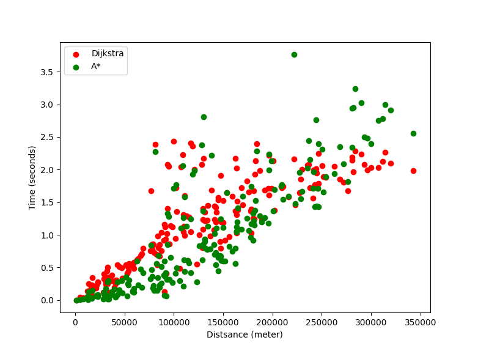
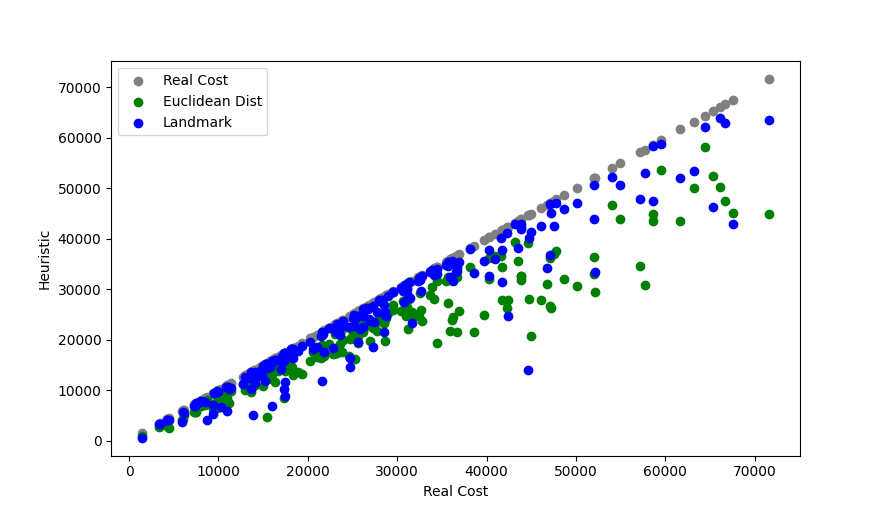
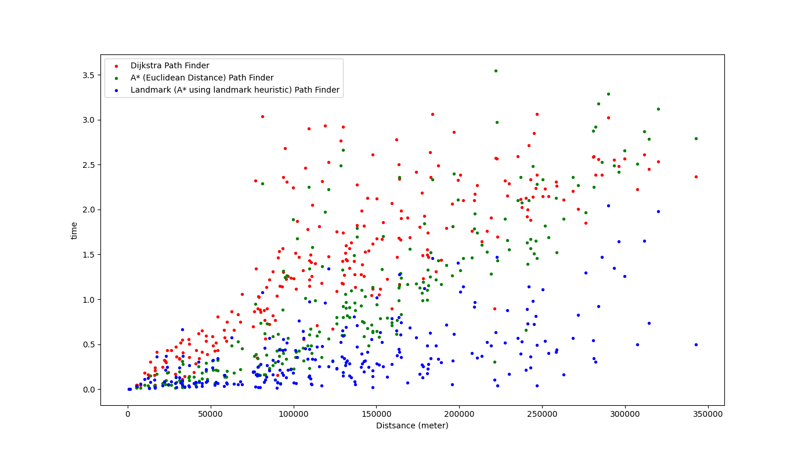

# OSM nx
 Try download OSM road network using [OSMnx](https://osmnx.readthedocs.io/en/stable/) and test different routing algorithm

 * Dijkstra
 * Two-way Dijkstra
 * A-Star
 * Landmark
 * Contractino heirarchy


## OSMnx

Build upon [GeoPandas](https://geopandas.org/en/stable/) and [NetworkX](https://networkx.org/)

## NetworkX
* [GrapView](https://networkx.org/documentation/stable/reference/classes/index.html#module-networkx.classes.graphviews) provides helpful methods like [reversing a graph](https://networkx.org/documentation/stable/reference/classes/generated/networkx.classes.graphviews.reverse_view.html#networkx.classes.graphviews.reverse_view) which can be very helpful when calculating landmark heuristic.


## GraphML
http://graphml.graphdrawing.org/primer/graphml-primer.html

### Resource
* https://osmnx.readthedocs.io/en/stable/
* https://github.com/gboeing/osmnx-examples/ See notebooks

### Set up instruction
[Installation guide](https://osmnx.readthedocs.io/en/stable/) or `pip install osmnx`

## Road Network
In the Taiwan road network: there are about 229378 nodes and 592208 arcs(edges).


## Learnings

When comparing Dijkstra and A* in a city area, A* is not always faster in the following scenarios:
 * For euclidiance distance heuristic. A route with 60 nodes, Dijkstra explored 6555 nodes, A-star explored 1704 nodes. But how we calculate the euclidiance distance vastly affects the performance of A*; For example, great circle distance taks a long time to calculate vs cartesian distance is super fast
 * For longer route accross Taiwan (e.g. Taipei to Kaohsiung), pretty much both algorithm will explore/settle the whole graph, hence it's not helping much.
  


### Algorithm

#### Dijkstra

Dijkstra (and also A*) utilaize a priority queue to find the lowest cost in the frontier.
Heap (used as a priortiy queue) don't usually support DecreaseKey (or updateKey) operation.
We simply append a new set (new_cost, node) into the heap and ignore any already explored
(settled) keys in the while loop in Dijkstra. This is pretty much as efficient due to the
nature of road network (almost a planer graph).

#### A*

Heuristics must be admissive (under estimate the real cost) and monotone (suffice the triangular inequality). Landmark heuristic takes a long time to precompute but is in general "closer" (under estimate less) to the real cost, hence can provide a better guidance to the real shortest path.

**Heuristic Estimation**


**Number of nodes settled**


**Time used to generate route**


See compare_hueristics.py


* Euclidiance distance heuristic
* Landmark heuristic
    For any node u, v, landmark l

    ```
    dist(u,l) <= dist(u,v) + dist(v,l)  // by monotone
    dist(l,v) <= dist(l,u) + dist(u,v)  // by monotone
    ```

    The above inequality and be re-written as

    ```
    dist(u,l) - dist(v,l) <= dist(u,v)
    dist(l,v) - dist(l,u) <= dist(u,v)
    ```
    Hence by combining the two we get the landmark heuristic

    ```
    h(u,v) == max( dist(u,l)-dist(v,l), dist(l,v)-dist(l,u) ) <= dist(u.v)
    ```

# Road Network Files

We can clean & compact road network into probocol buffer format and reach a
compression rate of 12.5% of the original file size
See `convert_gpickle_to_proto.py` for details.

## Size and time to load network using gpickle

|                | Time to load | # Nodes | # Edges | Size  | PB Size |
| -------------- | ------------ | ------- | ------- | ----- | ------- |
| taipei         | 0.3 sec      | 11,062  | 26,045  | 5.3 M | 764k    |
| greater_taipei | 1.12 sec     | 36,879  | 89,257  | 20 M  | 2.5 M   |
| taiwan         | 7.11 sec     | 229,378 | 592,208 | 124 M | 16M     |

## Size and time to load network using protocol buffer

|                | Time to load | # Nodes | # Edges | PB Size |
| -------------- | ------------ | ------- | ------- | ------- |
| taipei         | 0.24 sec     | 11,062  | 26,045  | 764k    |
| greater_taipei | 0.93 sec     | 36,879  | 89,257  | 2.5 M   |
| taiwan         | 5.84 sec     | 229,378 | 592,208 | 16M     |

## Helpful Tools

Get Latitude Longitude on Map
* https://www.latlong.net/
